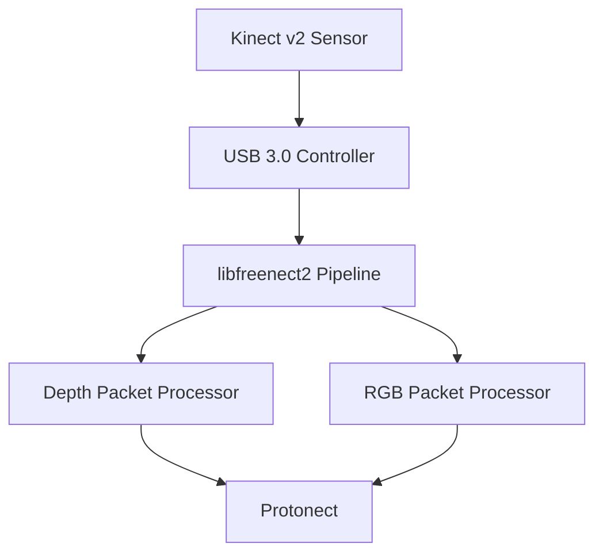

# System Architecture

## High-Level Overview
- USB 3.0 Kinect v2 sensor connected to Raspberry Pi 5.
- libfreenect2 fork compiled with NEON-enabled CPU pipeline.
- Protonect demo used for validation.

## Components
- **Depth Packet Stream Parser:** Handles incoming isochronous depth packets.
- **CPU Depth Packet Processor:** NEON-optimized code path for Pi.
- **Transfer Pools:** USB bulk/isochronous handling.
- **Protonect:** Reference application for testing.

## Data Flow
1. USB transport delivers RGB and depth packets.
2. Depth parser assembles subsequences; CPU processor converts to depth/IR frames.
3. Processed frames delivered to listeners for display or logging.

## Dependencies
- libusb for USB transport.
- libturbojpeg for RGB decoding.
- CMake build system.
- Raspberry Pi Ubuntu packages for toolchain.

## Deployment
- Build tree: `build/`
- Install prefix: `$HOME/freenect2`
- Run: `build/bin/Protonect cpu -noviewer`

## Future Enhancements
- Document OpenCL/OpenGL support feasibility on Pi.
- Automate USB tuning (buffer sizes, power settings).
